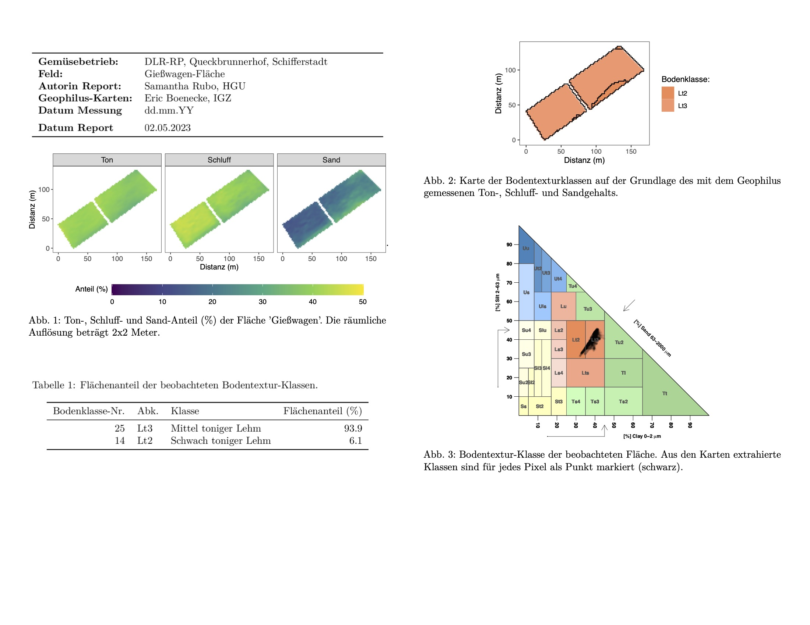

# Bodentextur von Praxis-Flächen

### Projektbeschreibung
Dieses Repository enthält ein RMD-Skripte (`Bodentextur_Report_default.Rmd`), welches die Bodentextur basierend auf Geophilus-Messungen ermittelt und die Ergebnisse in einem umfassenden Report zusammenfasst und visualisiert. Der generierte Report enthält sowohl numerische Ergebnisse als auch grafische Darstellungen der Bodentextur, um eine klare Interpretation der Daten zu ermöglichen.

### Ausgabe
Das Skript erstellt einen Report, der Folgendes enthält:
1. Grafische Visualisierungen der Bodentexturverteilung
2. Zusammenfassende Statistiken und Interpretationen der Bodentexturwerte
3. Eine CSV-Datei mit den berechneten Bodentexturdaten für eine weitergehende Analyse

### Beispiel:
